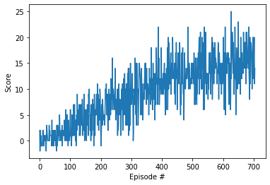

# Deep Reinforcement Learning Nano Degree Project1

Author: Ryuichi Hoshi (hoshi.ryuichi@gmail.com)

Date: 2021/04/04

# Environment

The purpose of an agent is to navigate and collect as many yellow bananas as possible.
A reward of +1 is provided for collecting a yellow banana, and a reward of -1 is provided for
collecting a blue banana.

### Observations

The state space has 37 dimensions and contains the agent's velocity, along with ray-based
perception of objects around agent's forward direction.

### Actions
Four discrete actions are available, corresponding to:
- **`0`** - move forward.
- **`1`** - move backward.
- **`2`** - turn left.
- **`3`** - turn right.

### Episode
The task is episodic. The environment is considered as solved when an agent gets an average score of +13 over 100
consecutive episodes.


# Learning Algorithm

Deep Q Network (DQN) is used to solve the problem which takes the state as
input, and returns a set of action value for possible actions of the environment.

The algorithm uses a neural network as function approximation. This tables shows the structure of the neural network:

Layer | Type | Input | Output | Activation
----------- | ------------- | ------- | ------- | -------
Input Layer | Fully Connected | 37 | 64 | ReLu
Hidden Layer1 | Fully Connected | 64 | 64 | ReLu
Output Layer | Fully Connected | 64 | 4 | - 

### Experience Replay
In order to increase efficiency of the learning, the agent uses Experience Replay which 
stores a set of experience tuples `(state, action, reward, next_state, done)`. In the step function, 
the agent checks if the replay buffer stores enough number of experiences defined as `BATCH_SIZE`
and samples out of experiences.

Parameter Name | Value
------------ | -------------
Replay Buffer Size | 1e5
Mini Batch Size | 64
Update every (How often to update the network) | 4


### Hyper Parameters
The agent uses following parameters for the learning. Although the problem is considered as solved
when an agent gets an average score of +13 over 100 consecutive episodes, but I set the target as 15
to have better-learned agent.

Parameter Name | Value
------------ | -------------
Learning goal | +15
Epsilon start | 1.0
Epsilon end | 0.01
Epsilon decay | 0.995
GAMMA (Discount Factor) | 0.99
TAU (Soft update of target parameter) | 1e-3
Learning Rate | 5e-4


# Result
The agent solved the environment in 705 episodes with average score, 15.00. 
Here is the log of the learning and plot of average scores."

```angular2html
Episode 100	Average Score: 0.96
Episode 200	Average Score: 4.31
Episode 300	Average Score: 7.17
Episode 400	Average Score: 10.08
Episode 500	Average Score: 12.70
Episode 600	Average Score: 13.85
Episode 700	Average Score: 14.87
Episode 705	Average Score: 15.00
Environment solved in 705 episodes!	Average Score: 15.00
```


# Ideas for Future Work
In order to improve the efficiency of the learning, we could apply 
[Prioritized Experience Replay]("https://arxiv.org/abs/1511.05952") which replay 
important transitions more frequently.