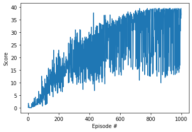

# Deep Reinforcement Learning Nano Degree Project2

Author: Ryuichi Hoshi (hoshi.ryuichi@gmail.com)

Date: 2021/07/12

# Environment

The purpose of an agent is to move its hand to the goal location, and keep it there for as many time steps as possible.
Its hand is Double-jointed arm which can move to target locations.
A reward of +0.1 is provided for each step that the agent's hand is in the goal location. 

### Observations

The observation space consists of 33 variables corresponding to position, rotation, velocity, and angular velocities of the arm. 

### Actions
Each action is a vector with four numbers, corresponding to torque applicable to two joints. Every entry in the action vector should be a number between -1 and 1.

### Episode
The task is episodic. The environment is considered as solved when an agent gets an average score of +30 over 100
consecutive episodes.


# Learning Algorithm

DDPG is used to solve the problem which uses two types of network, Policy Gradient as an Actor
and DQN as a Critic. Actor takes the state as input, and returns a set of action value for possible actions of the environment.
Critic approximates State-Action function by receiving states and actions as an input. 
The returned value of Critic is also used as a target for the policy gradient of the Actor.

As a part of DDPG, the agent uses local network and target network which is gradually 
updated by 'soft-update'.


*Actor* 

Actor receives states and output actions by going through a hidden layer. 

Layer | Type | Input | Output | Activation
----------- | ------------- | ------- | ------- | -------
Input Layer | Fully Connected | 33 | 256 | ReLu
Hidden Layer1 | Fully Connected | 256 | 128 | ReLu
Output Layer | Fully Connected | 128 | 4 | - 

*Critic* 

Critic receives both states and actions. States are passed into the Input layer
and its output are concatenated with actions, and send into Hidden Layer1. 

Layer | Type | Input | Output | Activation
----------- | ------------- | ------- | ------- | -------
Input Layer | Fully Connected | 33 | 256 | Leaky ReLu
Hidden Layer1 | Fully Connected | 260 | 128 | Leaky ReLu
Output Layer | Fully Connected | 128 | 1 | - 

### Experience Replay
In order to increase efficiency of the learning, the agent uses Experience Replay which 
stores a set of experience tuples `(state, action, reward, next_state, done)`. In the step function, 
the agent checks if the replay buffer stores enough number of experiences defined as `batch_size`
and samples out of experiences.

Parameter Name | Value
------------ | -------------
Replay Buffer Size | 1e6
Mini Batch Size | 512


### Hyper Parameters
The agent uses following parameters for the learning. The problem is considered as solved
when an agent gets an average score of +30 over 100 consecutive episodes. The goal is achieved with these hyper
parameters.

Parameter | Default Value |
:--- | --- |
Replay Buffer Size | 1e6 |
Mini Batch Size | 512 |
Actor Learning Rate | 1e-5 |
Critic Learning Rate | 1e-4 |
Gamma | 0.99 |
Tau for soft updating | 1e-3 |
Weight Decay for Critic | 0 |
Sigma of Noise | 0.2 |
Random Seed | 123 |
Update every (How often to update the network) | 20
Update times (How many updates are done in each update time) | 10


# Result
The agent solved the environment in 700 episodes with average score, 31.07, and 
reached to 30.00 after 1000 episodes.

```angular2html
Episode 100	Average Score: 2.30
Episode 200	Average Score: 10.43
Episode 300	Average Score: 16.17
Episode 400	Average Score: 20.75
Episode 500	Average Score: 23.25
Episode 600	Average Score: 27.01
Episode 700	Average Score: 31.07
Episode 800	Average Score: 30.39
Episode 900	Average Score: 31.56
Episode 1000	Average Score: 31.57
```


# Ideas for Future Work
[Twin Delayed Deep Deterministic Policy Gradients (TD3)]("https://arxiv.org/pdf/1802.09477.pdf") mentioned as follows.
```angular2html
In value-based reinforcement learning methods such as deep Q-learning, 
function approximation errors are known to lead to overestimated 
value estimates and suboptimal policies.
``` 
Actually, our agent introduced noises to actions for more exploration and lower learning rates for
gradual learning to avoid suboptimal policies. TD3 is expected to mitigate the issue and
increase the stability of learning and conversion speed.